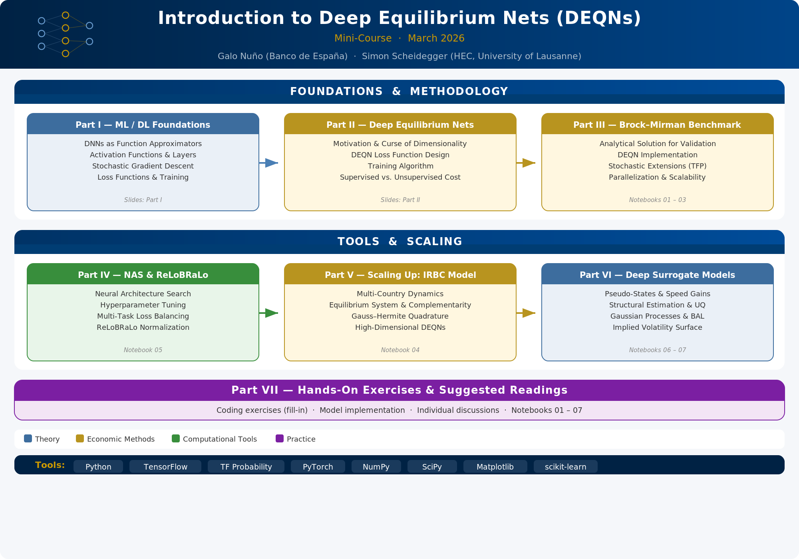

# Introduction to Deep Equilibrium Nets (DEQNs)
*(A Mini-Course, March 2026)*

**Galo Nuño** ([Banco de España](https://www.galonuno.com/))
**Simon Scheidegger** ([HEC, University of Lausanne](https://sites.google.com/site/simonscheidegger/))

---

## Purpose of the Lectures

This self-contained mini-course introduces **Deep Equilibrium Nets (DEQNs)**, a method that uses deep neural networks to solve high-dimensional dynamic stochastic economic models. DEQNs replace traditional grid-based collocation with neural network training, where the loss function is derived directly from the economic equilibrium conditions — no labeled data is needed.

The course covers the necessary ML/DL foundations, develops the DEQN methodology from scratch, applies it to the Brock–Mirman benchmark (which has an analytical solution), introduces practical tools such as Neural Architecture Search and loss normalization (ReLoBRaLo), and scales up to the multi-country International Real Business Cycle (IRBC) model.

The lectures combine theoretical discussions with hands-on coding exercises in Python.

---

## Prerequisites

- Basic knowledge of macroeconomics (Euler equations, dynamic programming)
- Familiarity with Python and Jupyter notebooks (see the [Python refresher](python_refresher/) included in this repository, or the more comprehensive [QuantEcon Python Programming](https://python-programming.quantecon.org/intro.html) course)
- Linear algebra and calculus fundamentals (see [Mathematics for Machine Learning](https://mml-book.github.io/))

### Useful Background References

- **I. Goodfellow, Y. Bengio, A. Courville** (2016). *Deep Learning.* MIT Press. [https://www.deeplearningbook.org](https://www.deeplearningbook.org)
- **K. P. Murphy** (2022). *Probabilistic Machine Learning: An Introduction.* MIT Press.
- **G. James et al.** (2021). *An Introduction to Statistical Learning (ISLR).* Springer. [https://www.statlearning.com](https://www.statlearning.com)

---

## Software Requirements

All notebooks run on **Python 3.9+**. The main dependencies are:

| Package | Purpose |
|---------|---------|
| [NumPy](https://numpy.org/) | Numerical computing |
| [SciPy](https://scipy.org/) | Scientific computing |
| [Matplotlib](https://matplotlib.org/) | Visualization |
| [TensorFlow](https://www.tensorflow.org/) >= 2.15 | Deep learning (DEQNs) |
| [TensorFlow Probability](https://www.tensorflow.org/probability) >= 0.23 | Probabilistic modeling |
| [PyTorch](https://pytorch.org/) >= 2.0 | Deep learning (selected notebooks) |

To install all dependencies at once:

```bash
pip install -r requirements.txt
```

---

## Course Overview



## Course Content

The slide deck ([`DEQN_MiniCourse.tex`](slides/DEQN_MiniCourse.tex)) is organized as follows:

| Part | Topic | Content |
|------|-------|---------|
| I | ML/DL Foundations | DNNs as function approximators, activation functions, SGD, loss functions |
| II | Deep Equilibrium Nets | Motivation, curse of dimensionality, DEQN loss function, training algorithm |
| III | Brock–Mirman Benchmark | Analytical test case, DEQN implementation, parallelization & scalability |
| IV | Practical Tools | Neural Architecture Search (NAS) and ReLoBRaLo loss normalization |
| V | Scaling Up — The IRBC Model | Multi-country model, equilibrium system, high-dimensional DEQNs |
| VI | Hands-on Exercises | Notebook overview and suggested readings |

---

## Code Notebooks

| # | Notebook | Topic |
|---|----------|-------|
| 01 | [`01_Brock_Mirman_1972_DEQN`](code/01_Brock_Mirman_1972_DEQN.ipynb) | DEQN: Deterministic Brock–Mirman with analytical benchmark |
| 02 | [`02_Brock_Mirman_Uncertainty_DEQN`](code/02_Brock_Mirman_Uncertainty_DEQN.ipynb) | DEQN: Stochastic Brock–Mirman with TFP shocks |
| 03 | [`03_DEQN_Exercises_Blancs`](code/03_DEQN_Exercises_Blancs.ipynb) | DEQN Exercises (blanks to fill in) |
| 03s | [`03_DEQN_Exercises_Solutions`](code/03_DEQN_Exercises_Solutions.ipynb) | DEQN Exercises (solutions) |
| 04 | [`04_IRBC_DEQN`](code/04_IRBC_DEQN.ipynb) | DEQN: International Real Business Cycle Model |
| 05 | [`05_Neural_Architecture_Search`](code/05_Neural_Architecture_Search.ipynb) | NAS via random search: hyperparameter tuning for DNNs |

---

## Readings

| Paper | File |
|-------|------|
| Azinovic, M., Gaegauf, L., & Scheidegger, S. (2022). Deep Equilibrium Nets. *International Economic Review*, 63(4), 1471–1525. | [`Azinovic_Gaegauf_Scheidegger_2022_DEQN.pdf`](readings/Azinovic_Gaegauf_Scheidegger_2022_DEQN.pdf) |
| Fernández-Villaverde, J., Nuño, G., & Perla, J. (2024). Taming the Curse of Dimensionality: Quantitative Economics with Deep Learning. *NBER Working Paper 33117*. | [`taming.pdf`](readings/taming.pdf) |
| Chen, H., Didisheim, A., & Scheidegger, S. (2026). Deep Surrogates for Finance: With an Application to Option Pricing. *Journal of Financial Economics*, 177, 104222. | [`DeepSurrogates_JFE.pdf`](readings/DeepSurrogates_JFE.pdf) |
| Friedl, A., Kübler, F., Scheidegger, S., & Usui, T. (2023). Deep Uncertainty Quantification: With an Application to Integrated Assessment Models. | [`DeepUQ_with_an_application_to_IAM.pdf`](readings/DeepUQ_with_an_application_to_IAM.pdf) |

---

## Citation

If you find this course material useful for your research, please cite the following papers:

```bibtex
@article{azinovic2022deep,
  title={Deep Equilibrium Nets},
  author={Azinovic, Marina and Gaegauf, Luca and Scheidegger, Simon},
  journal={International Economic Review},
  volume={63},
  number={4},
  pages={1471--1525},
  year={2022},
  publisher={Wiley},
  doi={10.1111/iere.12575}
}

@techreport{fernandezvillaverde2024taming,
  title={Taming the Curse of Dimensionality: Quantitative Economics with Deep Learning},
  author={Fern{\'a}ndez-Villaverde, Jes{\'u}s and Nu{\~n}o, Galo and Perla, Jesse},
  year={2024},
  institution={National Bureau of Economic Research},
  type={Working Paper},
  number={33117}
}
```

---

## License

This work is licensed under [CC0 1.0 Universal](LICENCE).
